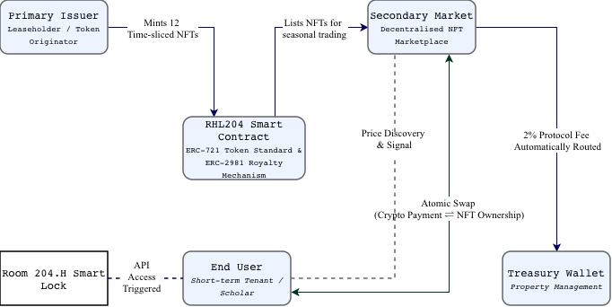

# Asset Tokenisation: Financial Design of Student Accommodation (RHL_X)

**IFTE0007 Decentralised Finance and Blockchain - Individual Coursework**

## 1. Executive Summary & Academic Framing
This repository contains the technical implementation and theoretical framework for the tokenisation of real-world assets (RWA). Specifically, this project develops a financial design framework that transforms illiquid, rigid student rental contracts (Eleanor Rosa House, Room X) into tradable, time-sliced, yield-bearing instruments. By integrating blockchain primitives, the model structurally eliminates intermediary friction, democratises market access, and facilitates dynamic price discovery for temporal utility.

## 2. System Architecture
The ecosystem operates on a trustless, cyber-physical loop bridging on-chain ownership with off-chain physical access.

*(The following diagram illustrates the flow of information, digital assets, and capital within the RHL_X ecosystem.)*

 

## 3. Core Smart Contract Mechanics
To ensure the tokenomics design perfectly aligns with the economic rationale, the `RosaHouseLease` (RHL_X) smart contract implements three vital mechanisms:

### A. Discrete Temporal Divisibility (`MAX_SUPPLY`)
- **Implementation:** The contract strictly limits the total supply using `uint256 public constant MAX_SUPPLY = 12;`.
- **Rationale:** This programmatic constraint represents the 12-month lease period. It ensures absolute structural scarcity, fractionalising a monolithic annual lease into discrete monthly units without infinite dilution.

### B. Programmable Value Capture (`ERC-2981`)
- **Implementation:** The contract integrates the ERC-2981 NFT Royalty Standard. Upon deployment, `_setDefaultRoyalty(msg.sender, 200)` automatically enforces a 2% (200 basis points) secondary market fee. 
- **Rationale:** This structural alignment ensures that the property management/landlord continuously captures value from secondary market liquidity, transforming them into an aligned beneficiary of the ecosystem.

### C. Primary Issuance Control (`mintLeaseMonths`)
- **Implementation:** A custom `mint()` function secured by the `onlyOwner` modifier, equipped with strict `require` firewalls to prevent minting beyond the maximum supply.
- **Rationale:** This facilitates the controlled primary issuance of the tokens, digitising the underlying abstract tenancy rights before they enter the permissionless secondary market.

## 4. Market & User Flow
1. **Primary Issuance:** The Originator (Leaseholder) mints 12 time-sliced NFTs.
2. **Market Listing:** NFTs are listed on a decentralised NFT marketplace, allowing for seasonal price discovery (e.g., September tokens commanding a premium over February tokens).
3. **Trustless Exchange:** Users purchase temporal rights via Atomic Swaps, eliminating traditional counterparty risk (simultaneous exchange of Crypto ⇌ NFT).
4. **Physical Access:** On-chain NFT ownership directly and synchronously triggers the Smart Lock API for physical room access.
5. **Fee Routing:** Secondary trading automatically routes the 2% protocol fee to the treasury.

## 5. Academic Limitations & Systemic Risks
While structurally efficient, this tokenised model acknowledges several irreducible real-world boundaries:
- **Oracle Dependency:** The system relies on physical oracles (inspectors or IoT sensors) to report property damage. Smart contracts are inherently blind; off-chain physical degradation cannot be autonomously reflected in the on-chain asset value.
- **Physical Enforcement Constraints:** Smart contracts lack physical agency. They cannot physically evict a tenant who manually sabotages the electronic lock or refuses to vacate the premises, highlighting the limits of technological governance.
- **Liquidity Risk in Thin Markets:** Tokenisation does not guarantee liquidity. In thin secondary markets (e.g., extremely low demand during winter breaks), the token may suffer from asymmetric information and extreme price volatility.

## 6. Deployment & Verification
- **Network:** Ethereum Sepolia Testnet
- **Smart Contract Address (CA):** `0x4a98FdF1A24253888b46B2D2F288455aF7439743`
- **Token Standard:** ERC-721
- **Compiler Version:** Solidity ^0.8.20
